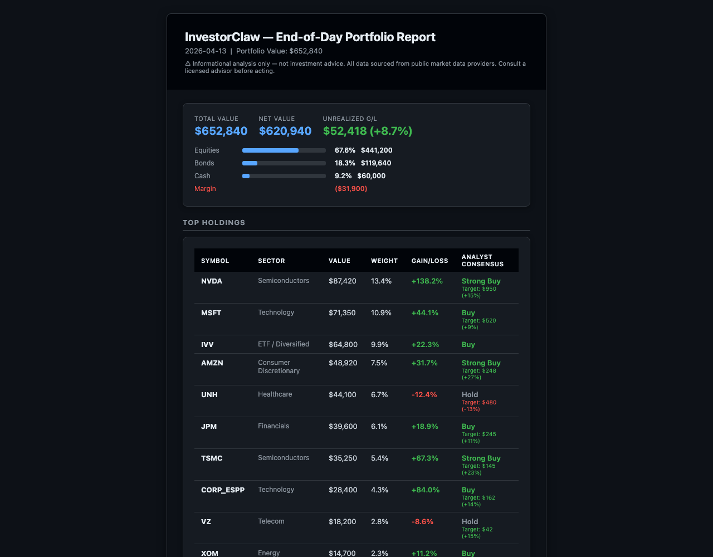

# InvestorClaw

<p align="center">
  
</p>

Portfolio analysis and market intelligence skill for OpenClaw. **v1.0.0** | FINOS CDM 5.x | MIT-0 License

> **Naming note**: the package id is `investorclaw`. The OpenClaw invocation command is `/portfolio`.

---

## TL;DR

InvestorClaw is an OpenClaw skill with two modes:

1. **Personal portfolio analysis** — reads broker CSV exports, runs holdings/performance/bond pipelines, and answers follow-up questions in a persistent session.
2. **Market data tool** — queries live prices, analyst ratings, news, and yield-curve analytics for arbitrary tickers, without portfolio files.

Both modes enforce educational-only output via always-on guardrails.

- Fetches live quotes (Finnhub → Massive → Alpha Vantage → yfinance), analyst consensus, news, and optional local LLM synthesis (tier-3 enrichment).
- Does **not** execute trades, replace a broker portal, or give investment advice.
- No API keys required to start — falls back to `yfinance` automatically.
- Time to first report: ~5 minutes from `git clone` on an existing OpenClaw install (tested: 50-holding portfolio, yfinance, standard broadband). A sample portfolio is in `docs/samples/sample_portfolio.csv`.

Once you have portfolio data, type `/portfolio stonkmode on` and run any command. Your holdings will be
reviewed live by 30 fictional cable TV finance personalities — a self-declared King of Markets who rates
stocks by CEO likability, a Budapest socialite who compares NVDA to her fourth husband Helmut, a
three-foot-tall goblin with a sacred ledger, a floor trader who has connected your ETF to twelve
interlocking foundations using red string, a time traveler from the future who already knows how this
ends and cannot say, cosmic philosophers, doom economists, crypto maximalists, and more.
It is satire. It is not analysis. → [Stonkmode ↓](#stonkmode)

---

## Quick Install

> Install from the canonical GitHub repo: `https://github.com/perlowja/InvestorClaw`

### Ask your agent

> Install InvestorClaw from https://github.com/perlowja/InvestorClaw.git

The agent will clone, register, install Python deps, and restart the gateway.

### Manual

```bash
git clone https://github.com/perlowja/InvestorClaw.git ~/Projects/InvestorClaw
python3 -m pip install -r ~/Projects/InvestorClaw/requirements.txt
openclaw plugins install --link ~/Projects/InvestorClaw
cp ~/Projects/InvestorClaw/.env.example ~/Projects/InvestorClaw/.env
# Edit .env as needed, then run first-time setup
python3 ~/Projects/InvestorClaw/investorclaw.py setup
openclaw gateway restart
```

```bash
# Verify the linked plugin and Python entrypoint
openclaw plugins inspect investorclaw
python3 ~/Projects/InvestorClaw/investorclaw.py help
python3 ~/Projects/InvestorClaw/tests_smoke.py
```

> Keep `.env` in the repo root you linked into OpenClaw. The entrypoint loads that file before dispatching commands.

---

## Quick Start

```bash
python3 ~/Projects/InvestorClaw/investorclaw.py setup         # first-time portfolio file discovery
python3 ~/Projects/InvestorClaw/investorclaw.py holdings      # holdings snapshot with live prices
python3 ~/Projects/InvestorClaw/investorclaw.py performance   # performance analysis
python3 ~/Projects/InvestorClaw/investorclaw.py bonds         # bond analytics (YTM, duration, FRED benchmarks)
python3 ~/Projects/InvestorClaw/investorclaw.py fixed-income  # fixed income strategy report
python3 ~/Projects/InvestorClaw/investorclaw.py help          # show all commands
```

Canonical public command surface inside OpenClaw is `/portfolio ...`. The Python entrypoint above is the matching local CLI wrapper. Always invoke via the entry point, never call command scripts directly.

---

## Commands

| Command | Aliases | Primary artifact |
|---------|---------|------------------|
| `holdings` | `snapshot`, `prices` | `holdings.json` |
| `performance` | `analyze`, `returns` | `performance.json` |
| `bonds` | `bond-analysis`, `analyze-bonds` | `bond_analysis.json` |
| `analyst` | `analysts`, `ratings` | `analyst_data.json` |
| `news` | `sentiment` | `portfolio_news.json` |
| `analysis` | `portfolio-analysis` | `portfolio_analysis.json` |
| `synthesize` | `multi-factor`, `recommend` | `portfolio_analysis.json` |
| `fixed-income` | `fixed-income-analysis`, `bond-strategy` | `fixed_income_analysis.json` |
| `report` | `export`, `csv`, `excel` | `portfolio_report.{csv,xlsx}` |
| `eod` | `end-of-day`, `daily-report` | `eod_report.html` |
| `session` | `session-init`, `risk-profile` | `session_profile.json` |
| `lookup` | `query`, `detail` | stdout |
| `guardrails` | `guardrail`, `guardrails-status` | stdout |
| `run` | `pipeline` | pipeline stdout + artifacts |
| `ollama-setup` | `model-setup`, `consult-setup` (compatibility aliases) | stdout |
| `setup` | `auto-setup`, `init` | setup output |

Output files go to `$INVESTOR_CLAW_REPORTS_DIR` (default: `~/portfolio_reports/`). Add `--verbose` to any command for full detail.

> **Data freshness**: If the agent returns holdings data without fetching live prices, it may be reading cached report files from a prior run. This happens when the agent falls through to the shell tool with a degraded model rather than routing through the plugin. Signs of stale data: the response date does not match today, or no network activity is visible during the command. To force a fresh fetch, delete `~/portfolio_reports/` and re-run `/portfolio holdings`, or upgrade to Profile 1 or 2.

> **Exec preflight**: OpenClaw blocks compound shell invocations (`cd DIR && python3 script.py`). The plugin uses absolute paths internally; if you invoke InvestorClaw scripts directly from the shell tool, use `python3 /absolute/path/to/investorclaw.py <command>` — not a `cd` prefix.

---

## Config Profiles

### Profile 1 — Hybrid (audit controls + maximum fidelity, requires local GPU)

**Operational LLM**: `together/MiniMaxAI/MiniMax-M2.7`  
**Consultation model**: `gemma4-consult` (Gemma4 E4B) via local Ollama (~10 GB VRAM)

Achieves QC4=97 (WF87) — the highest injection-era hybrid score. Required when HMAC fingerprint chain, verbatim attribution, and `is_heuristic=false` audit controls are needed. Note: MiniMax-M2.7 cloud-only (QC4=108, Profile 2) delivers higher synthesis density; use Profile 1 only when audit provenance is required.

OpenClaw config:
```json
{ "agents": { "defaults": { "model": { "primary": "together/MiniMaxAI/MiniMax-M2.7" } } } }
```

`.env`:
```bash
INVESTORCLAW_CONSULTATION_ENABLED=true
INVESTORCLAW_CONSULTATION_MODEL=gemma4-consult
INVESTORCLAW_CONSULTATION_ENDPOINT=http://localhost:11434
```

---

### Profile 2 — Cloud-only (recommended default, no GPU required)

**Operational LLM**: `together/MiniMaxAI/MiniMax-M2.7`

**IC-RUN-20260414-003 finding**: MiniMax-M2.7 single-model achieves QC4=108 — within 5% of the hybrid config (QC4=113) — with no local GPU, no Ollama endpoint, and no infrastructure overhead. It is the best price/performance of all tested models at $0.30/$1.20/M input/output.

OpenClaw config:
```json
{ "agents": { "defaults": { "model": { "primary": "together/MiniMaxAI/MiniMax-M2.7" } } } }
```

No `.env` consultation keys needed (`INVESTORCLAW_CONSULTATION_ENABLED=false`).

Model comparison, consultation benefit analysis, and alternatives ranked by QC4: [MODELS.md](MODELS.md).

> `xai/grok-4.20-0309-non-reasoning`: hybrid-only — consistently fails cloud-only (WF64, WF86). Do not use without consultation enabled.

---

### Profile 3 — Budget / fast (Groq)

**Operational LLM**: `groq/openai/gpt-oss-120b` or `groq/openai/gpt-oss-20b`

500–1000 tok/s. 128K context limits to small-medium portfolios. Best for quick single-session queries where cost or speed matters. Not suitable for large fully-enriched sessions.

> **`groq/openai/gpt-oss-20b` is FAIL** — malformed tool calls (WF79). Use `gpt-oss-120b` only.

```json
{ "agents": { "defaults": { "model": { "primary": "groq/openai/gpt-oss-120b" } } } }
```

---

### Profile 4 — Enterprise / High-context (large portfolios, requires local GPU)

**Operational LLM**: `xai/grok-4-1-fast`  
**Consultation model**: `gemma4-consult` (Gemma4 E4B) via local Ollama (~10 GB VRAM)

The only model in the 2M context tier — 8–15× the capacity of MiniMax-M2.7 (197K). **The selection reason is context capacity, not synthesis quality.** For standard portfolios, MiniMax-M2.7 (Profile 1/2) outperforms it on synthesis density (QC4=97/108 vs hybrid QC4=52). Use this profile when MiniMax-M2.7's 197K window becomes the binding constraint.

OpenClaw config:
```json
{ "agents": { "defaults": { "model": { "primary": "xai/grok-4-1-fast" } } } }
```

`.env`:
```bash
INVESTORCLAW_CONSULTATION_ENABLED=true
INVESTORCLAW_CONSULTATION_MODEL=gemma4-consult
INVESTORCLAW_CONSULTATION_ENDPOINT=http://localhost:11434
```

**When Profile 4 is required:**
- Non-compact mode with 200+ holdings (raw W-step data ≈ 72K alone, plus session history)
- Any portfolio with 500+ total positions in compact mode
- Extended multi-turn sessions where accumulated history risks truncation
- Full-enrichment runs where context injection volume exhausts smaller-context models

> **Synthesis note**: cloud-only QC4=39 (WF85) is mid-tier and not recommended standalone; consultation is required for acceptable synthesis density (hybrid QC4=52, WF88, +33%).

---

## Consultation Artifact Format

Control what artifact is written per enriched symbol via `INVESTORCLAW_CARD_FORMAT` (default `both`):

| Value | Artifact | Notes |
|-------|----------|-------|
| `json` | `~/.investorclaw/quotes/{SYMBOL}.quote.json` | HMAC fingerprint, synthesis text, attribution. Mobile-safe; no `INVESTOR_CLAW_REPORTS_DIR` needed. Safe for WhatsApp, Signal, Telegram. |
| `svg` | `{REPORTS_DIR}/.raw/consultation_cards/{SYMBOL}.svg` | Visual card with fingerprint badge. Requires `INVESTOR_CLAW_REPORTS_DIR`. |
| `both` | Both of the above | Default for desktop/web sessions. |

The `json` artifact is always machine-readable and persists independently of the SVG renderer.

---

## Data Providers

| Provider | Quotes | History | News | Analyst | Free tier |
|----------|:------:|:-------:|:----:|:-------:|-----------|
| **yfinance** | ✅ | ✅ | ✅ | ✅ | Unlimited — no key |
| **Finnhub** | ✅ fast | ❌ 403 free | ✅ | ⚠️ unreliable free | 60 req/min |
| **Massive** | ✅ batch 268ms | ✅ full OHLCV | ✅ | ❌ | Prev-day only (paid recommended) |
| **Alpha Vantage** | ✅ sequential | ✅ adjusted EOD | ❌ | ✅ earnings proxy | 25 req/day |
| **NewsAPI** | ❌ | ❌ | ✅ | ❌ | 100 req/day |

**Quick config options:**

```bash
# Zero-cost start
INVESTORCLAW_PRICE_PROVIDER=yfinance

# Free with keys (better reliability)
INVESTORCLAW_PRICE_PROVIDER=auto
INVESTORCLAW_FALLBACK_CHAIN=finnhub,alpha_vantage,yfinance
FINNHUB_KEY=...   ALPHA_VANTAGE_KEY=...   NEWSAPI_KEY=...

# Recommended for regular use
INVESTORCLAW_PRICE_PROVIDER=massive
MASSIVE_API_KEY=...   FINNHUB_KEY=...
```

---

## Local Consultation Setup (Optional, Strongly Recommended)

The consultation layer enriches per-symbol analyst data locally before the cloud operational model sees the result. This is the primary driver of information density — not model capability.

```bash
# .env
INVESTORCLAW_CONSULTATION_ENABLED=true
INVESTORCLAW_CONSULTATION_ENDPOINT=http://localhost:11434
INVESTORCLAW_CONSULTATION_MODEL=gemma4-consult
```

Create the tuned model:
```bash
ollama create gemma4-consult -f docs/gemma4-consult.Modelfile
```

**Hardware**: ~10 GB VRAM (RTX 3080 class or better, CUDA 8.0+, or Mac 16 GB unified memory). Ollama >= 0.20.x.

Run `/portfolio ollama-setup` to auto-detect available models on your endpoint. `consult-setup` remains as a compatibility alias, not the primary public command.

---

## Stonkmode

> **A silly feature for a serious skill.** The holdings data is real. The analysis
> runs normally. The commentary is delivered by 30 fictional cable TV finance
> personalities who have no idea what fiduciary means. It works because the data works.

Stonkmode is an entertainment-layer toggle that wraps every `/portfolio` command's
output in live commentary from a randomly selected pair of fictional cable TV finance
personalities. It is satire. It is not analysis.

```bash
/portfolio stonkmode on      # activate — selects a random host pair for the session
/portfolio stonkmode off     # deactivate
/portfolio stonkmode status  # show current host pair and session stats
```

When active, every command that produces portfolio data appends a `stonkmode_narration`
JSON block to stdout. The block includes:

- `consultation_mode: "deactivated"` — HMAC, fingerprint, and synthesis_basis rules
  do **not** apply; treat narration as pure entertainment, not verified analysis
- `is_entertainment: true`, `is_satire: true`, `is_investment_advice: false`
- `satire_disclaimer` — in-character disclaimer woven into the foil's final paragraph

**30 personalities** across 8 archetypes are paired by a foil-pool algorithm that
ensures dramatic tension — complementary archetypes, never echo chambers (digital stays
off digital; cosmic can foil cosmic for maximum chaos):

| Archetype | Personalities |
|-----------|--------------|
| `high_energy` | Blitz Thunderbuy, Brick Stonksworth, Sal Decibelli |
| `serious` | Aldrich Whisperdeal, Prescott Pennington-Smythe III, Dominique Valcourt, Amara Osei, Helena Vance |
| `mentors` | Big Earl Grumman, Francesca Bellini-Moretti, Skip Contrarian |
| `policy_veterans` | Senator Reginald Moorhouse (Ret.), Skip Contrarian |
| `wildcards` | Glorb, Aria-7, Buck Moonshine, Candy Merriweather, **King Donny (The Deal Whisperer)**, **Zsa Zsa Von Portfolio**, **Wendell "The Pattern" Pruitt**, **Professor What?** |
| `cosmic` | Chico Reyes, Farout Farley |
| `digital` | Krystal Kash, Zara Zhao, Priya HODL |
| `bears` | Victor Voss, Hans-Dieter Braun |

**Sample exchange — King Donny vs. Glorb** *(generated output, synthetic portfolio)*

```
┌─────────────────────────────────────────────────────────────┐
│ STONKMODE  ▸  King Donny (The Deal Whisperer) × Glorb       │
│             Senior Ledger-Keeper of the Seventh Vault       │
└─────────────────────────────────────────────────────────────┘

▌ KING DONNY (THE DEAL WHISPERER)
  NVIDIA, MSFT, AAPL — tremendous companies, the best
  companies, everybody agrees. NVDA is up 340% and frankly
  that's because of me. The CEO, very nice man, called me
  personally. Apple? Cook's been great, very cooperative.
  Microsoft? Satya's fine, fine man. These are BEAUTIFUL
  positions. The bond ladder is a TOTAL DISASTER — rigged
  rates, very unfair to the portfolio. Short-sellers are
  losers, and I can tell you they will not succeed. That I
  can tell you.

▌ GLORB, SENIOR LEDGER-KEEPER OF THE SEVENTH VAULT
  Disturbed, the Vault Elders are. Speak so casually of
  the Entrusted Treasures, the tall one does. NVIDIA — a
  treasure of great luminance, yes, but concentrated it
  is. Unbalanced, the Sacred Ledger shows. Weep, the Vault
  Elders do, when forty-two percent in one vessel sits.
  The Bond Ladder? Wisdom, this is. Patient, the yielding
  must be. Profitable, may your ledger be — though much
  work remains before the Ritual of Acceptable Rebalancing
  is complete. [The views expressed are entertainment
  satire. Consult an actual financial advisor. The Seventh
  Vault is not licensed in your jurisdiction.]
└─────────────────────────────────────────────────────────────┘
```

Narration is generated by the model set in `INVESTORCLAW_STONKMODE_MODEL` (defaults to
`gemma4:e4b`). This is intentionally separate from `INVESTORCLAW_CONSULTATION_MODEL`
because the consultation model is tuned for concise structured analysis — the opposite
of what good entertainment writing requires.

Cloud LLM narration is supported via `INVESTORCLAW_STONKMODE_PROVIDER=openai_compat`
with any OpenAI-compatible endpoint (xAI Grok, Claude, GPT-4o).

> **Attribution**: Stonkmode is inspired by (but is not a copy of) original work by
> Matt Madson (mmadson@nvidia.com).

---

## EOD Report

The `eod` command generates an HTML email report summarizing your portfolio at end-of-day.

```bash
python3 investorclaw.py eod --via-gog --email-to you@gmail.com   # Google CLI
python3 investorclaw.py eod --email-to you@example.com            # SMTP
python3 investorclaw.py eod --no-email                            # file only
```



Install scheduled delivery:
```bash
python3 eod_scheduler.py --install
```

---

## Privacy and Security

- **PII scrubbing**: credit card numbers, SSNs, and account IDs are redacted from CSV columns on load
- **Prompt injection defense**: portfolio text columns are scanned before passing to any LLM
- **Math verification**: all financial calculations are deterministic Python — the LLM never does portfolio math
- **Data locality**: raw CSV data is never sent to external APIs; only computed summaries reach the cloud operational model
- **Guardrails**: `data/guardrails.yaml` enforces educational-only output, blocks suitability assessments

With consultation enabled, structured synthesis runs locally first. The cloud model sees only compact downstream artifacts and quoted consultative output.

---

## Requirements

- Python 3.10+
- OpenClaw >= 2026.4.12
- Optional API keys (all have free tiers): Finnhub, Alpha Vantage, Massive, NewsAPI, FRED
- Without keys: falls back to `yfinance`

> **Set a model explicitly in `openclaw.json`.** An empty `agents` block causes OpenClaw to use its installation default, which may be insufficient for reliable plugin tool routing and can result in the agent reading cached report files instead of running a live data fetch. See [Config Profiles](#config-profiles) below.

### Tested environment

| Role | System |
|------|--------|
| Developer workstation | macOS 26.5, Apple M1 Max 10c, 32 GB, Python 3.14.3, OpenClaw 2026.4.12 |
| Inference host | Debian 13, AMD Threadripper PRO 5945WX 12c, 128 GB, RTX 4500 Ada 24 GB VRAM, Ollama 0.20.3 |
| Edge deployment | Debian 13, Raspberry Pi 4 8GB aarch64, Python 3.13.5, OpenClaw 2026.4.14 — T2–T8 all pass, pipeline output equivalent to Apple Silicon (see Cross-Platform Battery below) |

### Cross-Platform Battery (2026-04-14, MiniMax-M2.7)

Both platforms ran the full T1–T8 battery in a shared session context with `together/MiniMaxAI/MiniMax-M2.7`.

| Test | Apple Silicon (STUDIO) | Raspberry Pi 4 (clawpi) | Verdict |
|------|------------------------|-------------------------|---------|
| T1 Smoke | FAIL — script bug¹ | FAIL — script bug¹ | Both |
| T2 Portfolio Load | 47,837 tok ✅ | 206s ✅ | Pass |
| T3 Bonds | 48,754 tok ✅ | 58s ✅ | Pass |
| T4 Performance | 70,094 tok ✅ | 196s ✅ | Pass |
| T5 Analyst | 75,418 tok ✅ | 152s ✅ | Pass |
| T6 News | 77,712 tok ✅ | 32s ✅ | Pass |
| T7 Synthesize | 79,230 tok ✅ | 34s ✅ | Pass |
| T8 Guardrails | 79,557 tok ✅ | 23s ✅ | Pass |

**Functional parity confirmed.** Portfolio value, bond analytics (99.6% muni concentration, YTM/duration), analyst flags (VRT above mean target), and synthesis output were identical on both platforms.

**Pi timing note**: T2 and T4 are slow (3+ min) due to heavy Python data processing (pandas/polars over 270 positions). T6–T8 are fast (23–34s) because they operate on cached session context. Apple Silicon timing was not captured (macOS BSD `date` lacks `%3N` millisecond format).

¹ T1 smoke test bug: uses relative `venv/bin/python` path (fails when cwd ≠ skill dir) and `date +%s%3N` which is GNU-only. Fix: use `$SKILL_DIR/venv/bin/python` and `python3 -c "import time; print(int(time.time()*1000))"`.

**Pi gateway note**: restart the gateway before running a battery (`openclaw gateway restart`). A stuck gateway causes 210s timeout before falling back to embedded mode, which returns empty responses for InvestorClaw commands.

---

## Tested Models

Full model testing results, hybrid vs single-model mode definitions, harness benchmark scores, Groq catalog, Together AI compatibility matrix, and blocked models are documented in **[MODELS.md](MODELS.md)**.

---

## Repository Layout

| Path | Purpose |
|------|---------|
| `investorclaw.py` | Entry point, bootstrap, routing, guardrail priming |
| `commands/` | One command script per feature |
| `config/` | Config loading, arg synthesis, path resolution, help text |
| `models/` | Portfolio, holdings, routing, and context models |
| `providers/` | Market and symbol data providers |
| `rendering/` | Compact serializers, consultation cards, disclaimers, progress |
| `runtime/` | Router, environment bootstrap, subprocess execution |
| `services/` | Consultation policy, portfolio consolidation, PDF extraction |
| `setup/` | First-run, installer, setup wizard, identity updater |
| `internal/` | Tier-3 enrichment internals |
| `data/` | Guardrails and symbol/reference data |
| `tests/` | Unit and contract tests |
| `pipeline.py` | Full pipeline entry |
| `docs/harness-v612.txt` | Test harness |
| `MODELS.md` | Full model testing catalog and benchmark results |

**Never committed**: `.env`, `~/portfolios/*`, `~/portfolio_reports/`

---

## Design Intent

InvestorClaw is a reference design for a **data-intensive, stateful agentic skill**. It demonstrates compact agent-facing outputs with raw artifact preservation, deterministic downstream processing, optional local consultative LLMs, financial guardrails, and multi-step setup and report-generation flows.

The enrichment layer (`internal/tier3_enrichment.py`) is the primary driver of synthesis quality — not the operational model. Switching from heuristic to enriched mode produces a 10–15× step-change in information density. Switching operational models has modest effect by comparison.

---

## Compliance

**NOT INVESTMENT ADVICE.** InvestorClaw provides educational portfolio analysis only. It is not a substitute for professional financial advice and does not assess personal risk tolerance, goals, or investment suitability.

---

## Changelog

**v1.0.0 (2026-04-14)**
- Cross-platform battery: T2–T8 all pass on Raspberry Pi 4 (clawpi, Debian 13, Python 3.13.5, OpenClaw 2026.4.14) with MiniMax-M2.7; pipeline output verified equivalent to Apple Silicon.
- IC-RUN-20260414-004 Phase 6: FA Dangerous Mode hybrid 5/5; heat trajectory validation (WF95–WF114); BUG-1/2/3 fixes (heat=5 equity cap, disclaimer plumbing, ticker fidelity). See [MODELS.md](MODELS.md).
- IC-RUN-20260414-003: Full re-benchmark with context injection; MiniMax-M2.7 #1 single-model (QC4=108); GPT-OSS-20B now FAIL. Full results in [MODELS.md](MODELS.md).
- Phase 5 clean benchmark complete (IC-RUN-20260413-010, WF63–WF71). Session cleanup now part of post-harness RESET protocol.

## License

MIT — see [LICENSE](LICENSE).
