# Stonkmode — Entertainment Mode + Dr. Stonk Financial Education

<p align="center">
  
</p>

**v2.1.4** | 30 fictional cable TV finance personalities + educational mode

---

## What is Stonkmode?

After serious portfolio analysis, enable **Stonkmode** for AI-generated narrative commentary featuring 30 distinct fictional cable finance TV personalities. Each persona has a unique voice, perspective, and comedic flair—turning dry financial metrics into entertaining (and accurate) portfolio narratives.

**Stonkmode is entertainment, not advice.** Its existence is the clearest signal that InvestorClaw is NOT institutional financial software.

---

## Enable Stonkmode

```bash
# Activate stonkmode state file
/portfolio stonkmode on

# Run analysis — now with personality commentary
/portfolio holdings
/portfolio synthesize
/portfolio performance
```

Stonkmode wraps analysis output in character narration while preserving all underlying financial rigor. All math stays deterministic Python. The LLM only generates the entertaining framing.

---

## The 30 Personas

Stonkmode features 30 distinct fictional cable finance TV personalities organized in the gallery below.

---

### Character Gallery

| | | | | |
|---|---|---|---|---|
|  | 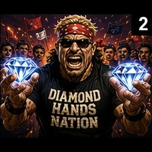 | 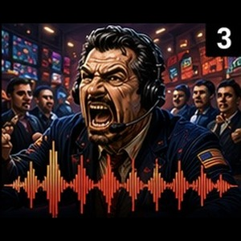 | 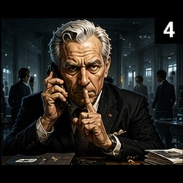 |  |
|  |  |  |  | 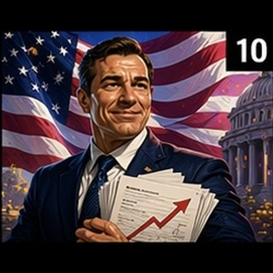 |
|  | 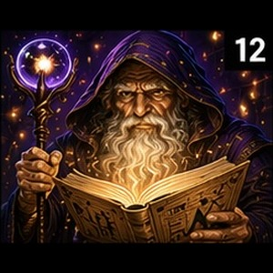 |  |  |  |
|  |  |  | 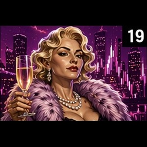 | 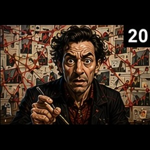 |
|  |  |  | 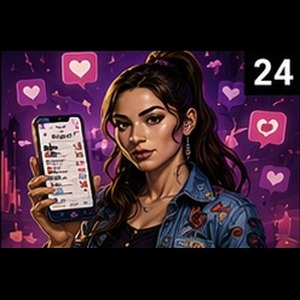 | 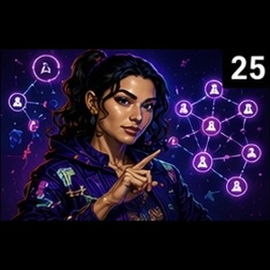 |
| 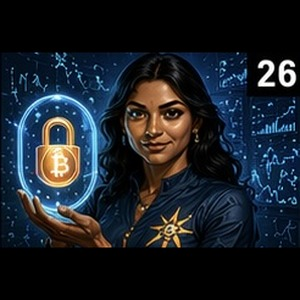 | 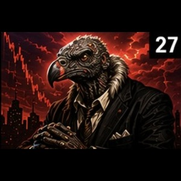 |  | 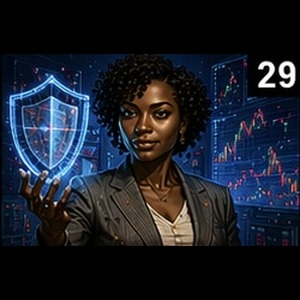 | 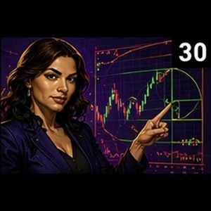 |

---

### Dr. Stonk — The 31st Persona

<p align="center">
  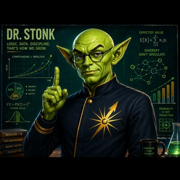
</p>

**From the planet Hephaestus, Dr. Stonk is here for your logical financial education.**

---

### Avatar Assets

- **30 extracted portraits**: 300×300px each, individually extracted from high-fidelity grid
- **Dr. Stonk**: 300×300px processed to match portrait gallery standard
- **Format**: High-quality AI-generated photorealistic artwork, PNG optimized
- **Storage**: `docs/assets/stonkmode-characters/{character_key}.jpg` for all 31 personas
- **Format**: High-quality AI-generated photorealistic artwork, JPEG quality 92

---

## Persona Descriptions

### 🔥 HIGH ENERGY

- **Blitz Thunderbuy** — Lightning desk-slap energy
- **Brick "Diamond Hands" Stonksworth** — Diamond hands conviction
- **Sal "The Pit" Decibelli** — Trading pit volume

### 💼 SERIOUS

- **Aldrich Whisperdeal** — Quiet deal sources
- **Carmen "Fib" Torres** — Technical pattern analysis
- **Dominique "Closing Bell" Valcourt** — Closing bell authority
- **Dr. Amara Osei-Bonsu** — Risk-control authority
- **Prescott Pennington-Smythe** — Macro interview gravitas

### 👨‍🏫 MENTORS

- **Baron Von Cashflow** — Cash-flow obsession
- **Big Jim Cashonly** — Coach-like tough love
- **Sunny Rainyday-Fund** — Rainy day fund calm

### 🏛️ POLICY VETERANS

- **Biff Chadsworth III** — Policy optimism
- **Skip "Well, Actually" Contrarian** — Well-actually skepticism

### 🎭 WILDCARDS

- **ARIA-7** — Sentient analysis unit
- **Chaz "The Razor" Leveridge** — Leveraged razor edge
- **Dorin Goleli** — Eternal ledger magic
- **Glorb** — Seventh vault ledger keeper
- **King Donny** — Deal-whispering monarch
- **Lafayette "$tacks" Beaumont** — MBA stacks
- **Professor Digby Goldbug** — Goldbug scholarship
- **Professor What?** — Temporal market confusion
- **Wendell "The Pattern" Pruitt** — Hidden pattern hunter
- **Zsa Zsa Von Portfolio** — Glamorous portfolio theater

### 🌌 COSMIC

- **"Far Out" Farley McGee** — Cosmic market drift
- **Chico "The Vibe" Reyes** — Market vibe reader

### 💻 DIGITAL

- **Krystal "The Receipt" Kash** — Receipt-driven social proof
- **Priya "HODL" Sharma** — HODL conviction
- **Zara "Viral" Zhao** — Viral algorithm energy

### 🐻 BEARS

- **Hans-Dieter Braun** — Disciplined doom spiral
- **Victor "The Vulture" Voss** — Vulture bear thesis

### 🖖 EDUCATORS

- **Dr. Stonk** — Logical financial education from the planet Hephaestus

---

## Dr. Stonk — Financial Education Mode

Use `--verbose` with Stonkmode to unlock **Dr. Stonk explanations**:

```bash
/portfolio holdings --verbose
```

Dr. Stonk (from the planet Hephaestus) provides plain-English definitions and context for:
- Portfolio metrics (Sharpe ratio, beta, max drawdown, concentration indices)
- Bond mathematics (YTM, duration, convexity, FRED Treasury benchmarks)
- Market data and analyst consensus
- Modern Portfolio Theory optimization

All explanations are educational only — never offering specific buy/sell recommendations.

---

## Configuration

Stonkmode is controlled by:

1. **State file**: `~/.investorclaw/stonkmode.json`
   - Enable/disable via `/portfolio stonkmode on` / `off`
   
2. **Environment variables** (v1.0.1+):
   - `INVESTORCLAW_NARRATIVE_PROVIDER` — cloud provider (openai_compat, ollama)
   - `INVESTORCLAW_NARRATIVE_ENDPOINT` — API endpoint or local Ollama
   - `INVESTORCLAW_NARRATIVE_MODEL` — model name (Together.ai MiniMax-M2.7, Google Gemini, etc.)
   - `INVESTORCLAW_STONKMODE_DISABLED` — set to `true` to disable in CI/test environments

See [CONFIGURATION.md](CONFIGURATION.md) for full var reference.

---

## Example Output

(Persona example transcripts archived off-repo to keep the skill payload small.)

Sample (from Blitz Thunderbuy):
> "THUNDER-BUY ALERT! Your portfolio is 68% equities with a Sharpe ratio of 1.42 — not bad for holding patterns, but we're leaving alpha on the table. The concentration here? AAPL eating 12% of your allocation while your bonds languish at 2.1% YTM. Time to rebalance and LET'S GO LONG!"

---

## Validation & Testing

All 30 personas have been validated:
- ✅ **41/41 unit tests** pass
- ✅ **500 pairing iterations** with zero guardrail violations
- ✅ **Data grounding**: Zero fabricated holdings
- ✅ **Compliance**: Entertainment disclaimer + no advice directives

See [STONKMODE_VALIDATION.md](../archive/reports/STONKMODE_VALIDATION.md) for full validation report (archived).

---

## Implementation Details

**Narrative Layer Architecture:**
- Optional LLM layer wraps deterministic Python analysis results
- Personas randomly selected from roster (no duplication in single session)
- Each persona gets compact JSON analyst data (holdings, metrics, bonds, news)
- Character narration added to JSON output under `stonkmode_narration` block
- All underlying math remains verifiable and deterministic

**Cost:**
- With cloud providers (Together.ai, Google): ~$0.30–1.00/query for narration
- With local Ollama: Free (runs on user's GPU)

**Latency:**
- Cloud: 1–3 seconds added per narration
- Local: 2–5 seconds depending on GPU

---

## What Stonkmode Is NOT

❌ Not investment advice — purely entertainment  
❌ Not a robo-advisor decision engine — personas don't pick stocks  
❌ Not replacing a financial advisor — use output as conversation starters only  
❌ Not altering portfolio math — narration layer is read-only

---

## See Also

- **Validation Report**: [STONKMODE_VALIDATION.md](../archive/reports/STONKMODE_VALIDATION.md) — Full persona roster, test results (archived)
- **Example Output**: persona transcripts archived off-repo
- **Configuration**: [CONFIGURATION.md](CONFIGURATION.md) — Narrative provider setup
- **Architecture**: [DUAL-MODEL-ARCHITECTURE.md](DUAL-MODEL-ARCHITECTURE.md) — How narrative layer integrates

---

**Questions?** Open an issue: https://gitlab.com/argonautsystems/InvestorClaw/-/issues
